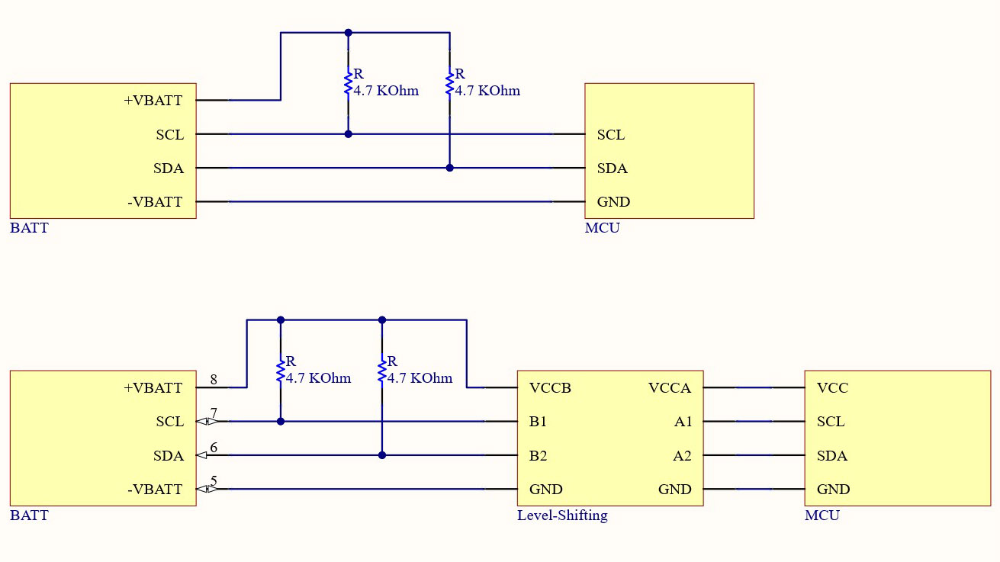

# I2CBATT
<!--  -->

* [Библиотека HDQBATT](https://github.com/S-LABc/HDQBATT)

## Содержание
* [Описание](#описание)
* [Особенности](#особенности)
* [Поддерживаемые платы](#поддерживаемые-платы)
* [API](#api)
* [Установка](#установка)
* [Подключение АКБ](#подключение-акб)
* [Дополнительная документация](#дополнительная-документация)

## Описание
* Библиотека для [Arduino IDE](https://www.arduino.cc/en/software), сделана в виде класса. Позволяет получить доступ к некоторым [основным](#основные-методы) функциям ([API](https://ru.wikipedia.org/wiki/API)) 
контроллера [bq27546](https://www.ti.com/product/BQ27546-G1) от компании [Texas Instruments](https://www.ti.com/), используя для связи интерфейс [I²C](https://ru.wikipedia.org/wiki/I%C2%B2C).
* *Можно* использовать для подключения к другим контроллерам семейства bq2754x, 
например [bq27541](https://www.ti.com/product/BQ27541-G1) или [bq27545](https://www.ti.com/product/BQ27545-G1), но адреса регистров и их названия будут отличатся. 
Для доступа к ним есть [вспомогательные](#вспомогательные-методы) функции.
* Эта библиотека является модифицированной библиотекой [HDQBATT](https://github.com/S-LABc/HDQBATT). [API](#api) совпадают, что дает возможность легко менять интерфейс.

## Особенности
* Конструктор класса принимает ссылку на объект **Wire**. Это позволяет работать с другими библиотеками и устройствами на одной шине I²C. Частота шины должна быть **400 кГц**.
* Библиотека позволяет читать информацию с АКБ от Apple **iPhone 8 - 12** включительно. В них используется интерфейс [I²C](https://ru.wikipedia.org/wiki/I%C2%B2C). В более ранних используется [HDQ](https://www.ti.com/lit/an/slua408a/slua408a.pdf).
* При использовании с микрокотроллерами, выводы которых **не толерантны к 5В**, **необходимо** использовать согласователь уровней, например [TXS0108E](https://www.ti.com/lit/ds/symlink/txs0108e.pdf)(HW-221) или подобный, иначе есть риск **спалить микроконтроллер!**

## Поддерживаемые платы
* Список плат и ядер, с которыми работает библиотека. *Проверен мной лично*. **Не забывайте про согласование уровней!**

| Плата | Ядро | Согласователь |
| :----: | :-------: | :-------: |
| STM32F103C8T6 | [Arduino_STM32](https://github.com/rogerclarkmelbourne/Arduino_STM32) | Нет |
| STM32F103C8T6 | [Arduino_Core_STM32](https://github.com/stm32duino/Arduino_Core_STM32) | Нет |
| STM32F401CCU6 | [Arduino_STM32](https://github.com/rogerclarkmelbourne/Arduino_STM32) | Нет |
| STM32F401CCU6 | [Arduino_Core_STM32](https://github.com/stm32duino/Arduino_Core_STM32) | Нет |
| STM32F411CEU6 | [Arduino_STM32](https://github.com/rogerclarkmelbourne/Arduino_STM32) | Нет |
| STM32F411CEU6 | [Arduino_Core_STM32](https://github.com/stm32duino/Arduino_Core_STM32) | Нет |
| STM32_F4VE | [Arduino_Core_STM32](https://github.com/stm32duino/Arduino_Core_STM32) | Нет |
| ESP8266 WeMos D1 Mini | [Arduino ESP8266](https://github.com/esp8266/Arduino) | [TXS0108E](https://www.ti.com/lit/ds/symlink/txs0108e.pdf) |
| ESP8266 WeMos D1 R2 | [Arduino ESP8266](https://github.com/esp8266/Arduino) | [TXS0108E](https://www.ti.com/lit/ds/symlink/txs0108e.pdf) |
| ESP32 Devkit V4 | [arduino-esp32](https://github.com/espressif/arduino-esp32) | [TXS0108E](https://www.ti.com/lit/ds/symlink/txs0108e.pdf) |
| Arduino Nano | Встроенное | Нет |
| Arduino Uno | Встроенное | Нет |
| Arduino Leonardo R3 | Встроенное | Нет |
| Arduino Pro Micro | Встроенное | Нет |
| Arduino Pro Mini | Встроенное | Нет |

## API

### Инициализация
* Создать объект с именем (в данном случае BATT), указав ссылку на объект Wire (**&Wire**).
```C++
I2CBATT BATT (TwoWire *twi);
```
* метод запуска линии I²C. Если эта библиотека единственная с I²C, то нужно вызвать его в *блоке setup()*
```C++
void begin(void);
```

### Основные методы
* Проверить соединение с АКБ. Построен на том же принципе, что и стандартный [сканер устройств I²C](https://playground.arduino.cc/Main/I2cScanner/).
```C++
bool isConnected(void);
```
* Запрос через регистр **CONTROL_STATUS**.
```C++
uint16_t getControlStatus(void);
bool getFlagSEPinIsActive(void);
bool getFlagIsFullAccessSealedMode(void);
bool getFlagIsSealedMode(void);
bool getFlagCalibrationFunctionIsActive(void);
bool getFlagCoulombCounterCalibrationRoutineIsActive(void);
bool getFlagBoardCalibrationRoutineIsActive(void);
bool getFlagQMAXUpdate(void);
bool getFlagHDQInterruptFunctionIsActive(void);
bool getFlagShutdownCommandIsSent(void);
bool getFlagRequestHibernateFromSleepMode(void);
bool getFlagIsFullSleepMode(void);
bool getFlagIsSleepMode(void);
bool getFlagImpedanceTrackAlgorithm(void);
bool getFlagRaTableUpdatesDisabled(void);
bool getFlagCellVoltagesOK(void);
bool getFlagQmaxUpdatesEnabled(void);
```
* Запрос регистра **Flags()**.
```C++
uint16_t getFlags(void);
bool getFlagBatteryHighIndicating(void);
bool getFlagBatteryLowIndicating(void);
bool getFlagChargeInhibitindicates(void);
bool getFlagFullChargedIsDetected(void);
bool getFlagChargeSuspend(void);
bool getFlagIndicatesComputedImax(void);
bool getFlagChargingAllowed(void);
bool getFlagStateOfChargeThreshold1(void);
bool getFlagStateOfChargeThresholdFinal(void);
bool getFlagDischargingDetected(void);
```
* Запрос **DEVICE_TYPE** через регистр *CONTROL_STATUS.* Позволяет получить *модель* контроллера АКБ. Например, если контроллер bq27546, то результат будет 0x0546.
```C++
uint16_t getDeviceType(void);
```
* Запрос **FW_VERSION** через регистр *CONTROL_STATUS.* Позволяет получить *версию прошивки* контроллера АКБ.
```C++
float getFirmwareVersion(void);
```
* Запрос **HW_VERSION** через регистр *CONTROL_STATUS.* Позволяет получить *версию оборудования* контроллера АКБ.
```C++
float getHardwareVersion(void);
```
* Запрос регистра **Temperature().** Позволяет получить *температуру контроллера* АКБ в градусах Кельвина, Цельсия, Фаренгейта.
```C++
float getTemperatureKelvin(void);
float getTemperatureCelsius(void);
float getTemperatureFahrenheit(void);
```
* Запрос регистра **Voltage().** Позволяет получить *напряжение* на банке АКБ в милливольтах и вольтах.
```C++
unsigned short getVoltageMilli(void);
float getVoltage(void);
```
* Запрос регистра **DesignCapacity().** Позволяет получить *заводскую емкость* банки в миллиамер-часах.
```C++
unsigned short getDesignCapacity(void);
```
* Запрос регистра **RemainingCapacity().** Позволяет получить *оставшуюся емкость* АКБ в миллиамер-часах.
```C++
unsigned short getRemainingCapacity(void);
```
* Запрос регистра **FullChargeCapacity().** Позволяет получить *доступную для зарядки емкость* АКБ в миллиамер-часах.
```C++
unsigned short getFullChargeCapacity(void);
```
* Запрос регистра **AverageCurrent().** Позволяет получить *ток зарядки/разрядки* АКБ в миллиамерах и амперах.
```C++
short getAverageCurrentMilli(void);
float getAverageCurrent(void);
```
* Запрос регистра **AveragePower().** Позволяет получить *мощность зарядки/разрядки* АКБ в милливаттах и ваттах.
```C++
short getAveragePowerMilli(void);
float getAveragePower(void);
```
* Запрос регистра **CycleCount().** Позволяет получить *количество зарядок/разрядок* АКБ.
```C++
unsigned short getCycleCount(void);
```
* Запрос регистра **StateOfCharge().** Позволяет получить *уровень зарядки* АКБ в процентах.
```C++
byte getStateOfCharge(void);
```
* Запрос регистра **TimeToEmpty().** Позволяет получить *врямя до полной разрядки* АКБ в минутах.
```C++
unsigned short getTimeToEmpty(void);
```
* Запрос регистров **Manufacturer Information Blocks.** Позволяет получить *данные о производителе* АКБ. Обычно в этих блоках серийные номера.
* В докумментации от bq27545 и bq27546, **Block C** не описан, но в нем есть данные. *Смотрите [bq27541 Single Cell Li-Ion Battery Fuel Gauge for Battery Pack Integration](https://www.ti.com/lit/ds/symlink/bq27541.pdf)*.
```C++
char* getManufacturerInfoBlockA(void);
char* getManufacturerInfoBlockB(void);
char* getManufacturerInfoBlockC(void);
```
* Запрос регистра **BlockDataChecksum().** Позволяет получить *контрольную сумму* регистров BlockData() контроллрера.
```C++
uint8_t getBlockDataChecksum(void);
```

### Вспомогательные методы
* прочитать байт из одиночного и слово из парного регистров.
```C++
uint8_t requestSingleRegister(void);
uint16_t requestPairRegisters(void);
```
* отправить байт команду для получения данных в регистрах **BlockData()**.
```C++
void sendCommandManufactureBlock(uint8_t command);
```
* отправить байт первого (*начального*) регистра. С этого байта будет начало запроса на чтение.
```C++
void sendFirstRegister(uint8_t reg_addr);
```
* записать слово в регистр **Control()**.
```C++
void writeControlAddresses(uint8_t low_payload, uint8_t high_payload);
```

## Установка
Скачать ZIP-архив нужной версии из раздела [Releases](https://github.com/S-LABc/I2CBATT/releases). Запустить [Arduino IDE](https://www.arduino.cc/en/software). Выбрать *Скетч* -> *Подключить библиотеку* -> *Добавить .ZIP библиотеку*. В появившемся окне выбрать скаченный архив. Более [наглядная](https://wiki.iarduino.ru/page/Installing_libraries) инструкция. **Не забудьте изучить скетч из примеров.**

## Подключение АКБ

* Для корректной передачи данных, необходимо между контактами **SDA-SCL** и **+VBATT** АКБ подключить резисторы номиналом 4.7кОм - 10кОм.
* *Можно* подключить резисторы к контакту +5В, но делать этого я **не рекомендую**, если контакт **не толерантен к 5В.**

## Дополнительная документация
* [HDQ Communication Basics](https://www.ti.com/lit/an/slua408a/slua408a.pdf)
* [HDQ Communication Basics for TI’s Battery Monitor ICs](https://www.ti.com/lit/an/slva101/slva101.pdf)
* [Start Guide for the BQ27546-G1](https://www.ti.com/lit/an/slua917/slua917.pdf)
* [Configuring the bq2754x Data Flash](https://www.ti.com/lit/an/slua503/slua503.pdf)
* [bq27546-G1 Technical Reference Manual](https://www.ti.com/lit/ug/sluub74/sluub74.pdf)
* [bq27546-G1 Single-Cell Li-Ion Battery Fuel Gauge for Battery Pack Integration](https://www.ti.com/lit/ds/symlink/bq27546-g1.pdf)
* [bq27545-G1 Single Cell Li-Ion Battery Fuel Gauge for Battery Pack Integration](https://www.ti.com/lit/ds/symlink/bq27545-g1.pdf)
* [bq27425-G2 System-Side Impedance Track™ Fuel Gauge With Integrated Sense Resistor](https://www.ti.com/lit/ds/symlink/bq27425-g2a.pdf)
* [bq27541 Single Cell Li-Ion Battery Fuel Gauge for Battery Pack Integration](https://www.ti.com/lit/ds/symlink/bq27541.pdf)
